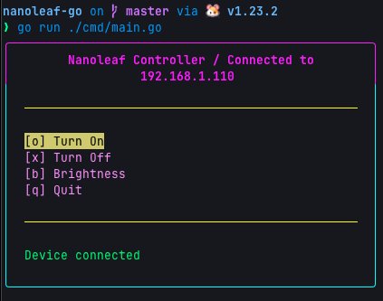

# Nanoleaf Go Controller

A TUI for controlling Nanoleaf devices written in Go.


## Features

- **Device Discovery**: Automatically scan for Nanoleaf devices on your network
- **Device Pairing**: Securely pair with Nanoleaf devices using the official API
- **Power Control**: Turn devices on/off with simple commands
- Brightness: Set device brightness
- **Configuration Management**: Automatic saving and loading of device configurations
- **Interactive UI**: TUI built with Bubble Tea

## Installation

### Prerequisites

- Go 1.23.2 or higher
- A Nanoleaf device on your local network

### Build from Source

```bash
# Clone the repository
git clone <repository-url>
cd nanoleaf-go

# Install dependencies
make deps

# Build the application
make build

# Run the application
./nanoleaf-go
```

## Usage

### Interactive Mode

Run the application to enter interactive mode:

```bash
./nanoleaf-go
```

Use the arrow keys to navigate the menu and press Enter to select options:

1. **Scan Devices**: Discover Nanoleaf devices on your network
2. **Pair Device**: Pair with a discovered device (requires physical button press)
3. **Turn On**: Turn on the paired device
4. **Turn Off**: Turn off the paired device
5. Brightness: Set device brightness
6. **Quit**: Exit the application

### Configuration

The application automatically saves device configurations to `~/.nanoleaf_config.json`. This file contains:

```json
{
  "ip": "192.168.1.100",
  "token": "your-auth-token"
}
```

## Development

### Running Tests

```bash
# Run all tests
make test

# Run tests with coverage
make test-coverage
```

### Code Quality

```bash
# Format code
make fmt

# Vet code
make vet

# Run linter (requires golangci-lint)
make lint

# Run all checks
make check
```

## Contributing

1. Fork the repository
2. Create a feature branch
3. Make your changes
4. Add tests for new functionality
5. Run `make check` to ensure code quality
6. Submit a pull request

## License

This project is licensed under the MIT License. See LICENSE file for details.
